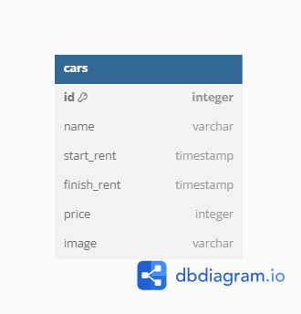

# Car Management Dashboard API
Hi read me pls :)


## ERD (Entity Relationship Diagram)




## API Reference

### Get all cars

```http
  GET /api/v1/cars
```

| Parameter | Type     | Description                |
| :-------- | :------- | :------------------------- |
| `api_key` | `string` | **Required**. Your API key |

#### Request

```http
    http://localhost:8000/api/v1/cars
```

#### Response

```json
[
    {
        "id": 1,
        "name": "Mustang",
        "start_rent": "2024-05-22T16:00:00.000Z",
        "finish_rent": "2024-05-22T16:00:00.000Z",
        "price": 3000000,
        "image": null
    },
    {
        "id": 2,
        "name": "Supra",
        "start_rent": "2024-05-21T16:00:00.000Z",
        "finish_rent": "2024-05-21T16:00:00.000Z",
        "price": 2000000,
        "image": null
    },
    {
        "id": 4,
        "name": "Gloo Em",
        "start_rent": "2024-02-15T16:00:00.000Z",
        "finish_rent": "2024-02-17T16:00:00.000Z",
        "price": 2000000,
        "image": "http://res.cloudinary.com/dhw7neqny/image/upload/v1716900395/jw7t0zvhbqj9q8jitwxq.png"
    }
]
```

### Get car

```http
  GET /api/v1/cars/${id}
```

| Parameter | Type     | Description                       |
| :-------- | :------- | :-------------------------------- |
| `id`      | `string` | **Required**. Id of item to fetch |

#### Request

```http
    http://localhost:8000/api/v1/cars/2
```

#### Response

```json
{
    "id": 2,
    "name": "Supra",
    "start_rent": "2024-05-21T16:00:00.000Z",
    "finish_rent": "2024-05-21T16:00:00.000Z",
    "price": 2000000,
    "image": null
}
```

### Add car

```http
  POST /api/v1/cars/${id}
```

| Payload | Type     | Description                       |
| :-------- | :------- | :-------------------------------- |
| `body`      | `form-data` | **Required**. Request body of item to update |

| Body | Type     | Description                       |
| :-------- | :------- | :-------------------------------- |
| `name`      | `string` | **Required**. Name of cars |
| `start_rent`      | `date` | **Required**. Starting date of rent |
| `finish_rent`      | `date` | **Required**. End date of rent |
| `price`      | `integer` | **Required**. Price of cars to rent |
| `image`      | `file` | **Required**. Picture of cars |

#### Request

```http
    http://localhost:8000/api/v1/cars
```

#### Response
```json
{
    "name": "Malicious Warpath",
    "start_rent": "2024-03-11T16:00:00.000Z",
    "finish_rent": "2024-03-11T16:00:00.000Z",
    "price": 5000000,
    "image": "http://res.cloudinary.com/dhw7neqny/image/upload/v1716989366/ynwsesdutfavqzhiinxv.png",
    "id": 5
}
```

### Delete car

```http
  DELETE /api/v1/cars/${id}
```

| Parameter | Type     | Description                       |
| :-------- | :------- | :-------------------------------- |
| `id`      | `string` | **Required**. Id of item to delete |

#### Request

```http
    http://localhost:8000/api/v1/cars/5
```

#### Response
```json
Data berhasil di hapus
```

### Update/Edit car

```http
  PUT /api/v1/cars/${id}
```

| Parameter | Type     | Description                       |
| :-------- | :------- | :-------------------------------- |
| `id`      | `string` | **Required**. Id of item to update |

| Payload | Type     | Description                       |
| :-------- | :------- | :-------------------------------- |
| `body`      | `form-data` | **Required**. Request body of item to update |

| Body | Type     | Description                       |
| :-------- | :------- | :-------------------------------- |
| `name`      | `string` | **Required**. Name of cars |
| `start_rent`      | `date` | **Required**. Starting date of rent |
| `finish_rent`      | `date` | **Required**. End date of rent |
| `price`      | `integer` | **Required**. Price of cars to rent |
| `image`      | `file` | **Required**. Picture of cars |

#### Request

```http
    http://localhost:8000/api/v1/cars/4
```

#### Response
```json
Data berhasil di update
```